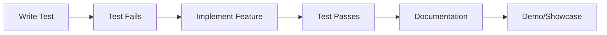

# Development Protocol 🧪

## Feature Implementation Workflow

### 1. Test-Driven Development (TDD) Process



### 2. Step-by-Step Implementation

#### Step 1: Write Failing Test
```bash
# Create test file
touch src/features/[feature-name]/tests/[feature-name].test.tsx

# Run tests to ensure failure
npm run test -- --watch
```

**Test Template:**
```typescript
import { describe, it, expect, beforeEach } from 'vitest'
import { render, screen } from '@testing-library/react'
import { [FeatureName] } from '../[FeatureName]'

describe('[FeatureName]', () => {
  it('should [expected behavior]', () => {
    // Arrange
    const props = {}
    
    // Act
    render(<[FeatureName] {...props} />)
    
    // Assert
    expect(screen.getByText('[expected text]')).toBeInTheDocument()
  })
})
```

#### Step 2: Implement Feature
```bash
# Create feature directory structure
mkdir -p src/features/[feature-name]/{components,hooks,utils,types,tests}

# Create main component
touch src/features/[feature-name]/[FeatureName].tsx
```

**Component Template:**
```typescript
import React from 'react'
import { motion } from 'framer-motion'
import type { [FeatureName]Props } from './types'

export const [FeatureName]: React.FC<[FeatureName]Props> = ({ 
  ...props 
}) => {
  return (
    <motion.div
      initial={{ opacity: 0 }}
      animate={{ opacity: 1 }}
      className="..."
    >
      {/* Feature implementation */}
    </motion.div>
  )
}

export default [FeatureName]
```

#### Step 3: Verify Test Passes
```bash
# Run specific test
npm run test -- src/features/[feature-name]/tests/

# Run all tests
npm run test
```

#### Step 4: Create Documentation
```bash
# Create documentation file
touch src/features/[feature-name]/README.md
```

**Documentation Template:**
```markdown
# [Feature Name]

## Overview
Brief description of what this feature does and why it exists.

## Usage
```typescript
import { [FeatureName] } from '@/features/[feature-name]'

<[FeatureName] 
  prop1="value"
  prop2={callback}
/>
```

## Props
| Prop | Type | Required | Description |
|------|------|----------|-------------|
| prop1 | string | Yes | Description |
| prop2 | function | No | Description |

## Supabase Integration
- Tables used: `table_name`
- Real-time subscriptions: `channel_name`
- Functions called: `function_name()`

## Animation Details
- Entry animation: `slideInLeft`
- Hover effects: `scale + glow`
- Exit animation: `fadeOut`

## Testing
```bash
npm run test -- src/features/[feature-name]/tests/
```

## Dependencies
- framer-motion
- @supabase/supabase-js
- three (if 3D)

## Performance Considerations
- Lazy loading: Yes/No
- Virtualization: If applicable
- Optimization notes
```

#### Step 5: Add to Showcase
```typescript
// Add to src/pages/Portfolio.tsx or main showcase area
import { [FeatureName] } from '@/features/[feature-name]'

// Include in demo section with explanation
```

## 3. File Structure Convention

```
src/features/[feature-name]/
├── README.md                 # Feature documentation
├── [FeatureName].tsx        # Main component
├── index.ts                 # Barrel exports
├── components/              # Sub-components
│   ├── [SubComponent].tsx
│   └── index.ts
├── hooks/                   # Custom hooks
│   ├── use[FeatureName].ts
│   └── index.ts
├── utils/                   # Helper functions
│   ├── [feature-helpers].ts
│   └── index.ts
├── types/                   # TypeScript definitions
│   ├── [feature-name].types.ts
│   └── index.ts
├── tests/                   # Test files
│   ├── [FeatureName].test.tsx
│   ├── hooks.test.ts
│   └── utils.test.ts
└── styles/                  # Component-specific styles
    └── [feature-name].module.css
```

## 4. Naming Conventions

### Components
- **PascalCase**: `MoleculeEffect`, `InterviewTimer`
- **Descriptive**: `ScrollTriggeredAnimation`, `MouseProximityFace`

### Files
- **kebab-case**: `molecule-effect.tsx`, `interview-timer.tsx`
- **Test files**: `[component-name].test.tsx`

### Supabase
- **Tables**: `snake_case` (`interview_questions`, `drum_videos`)
- **Functions**: `camelCase` (`getUserProgress`, `saveAnswers`)

## 5. Git Workflow

### Branch Naming
```bash
feature/[feature-name]      # New features
fix/[bug-description]       # Bug fixes
refactor/[area]            # Code improvements
docs/[documentation-area]   # Documentation updates
```

### Commit Messages
```
type(scope): description

[optional body]

[optional footer]
```

**Types**: `feat`, `fix`, `docs`, `style`, `refactor`, `test`, `chore`

**Examples**:
```
feat(interview-tool): add timed question display
fix(molecule-effect): resolve particle collision detection
docs(readme): update installation instructions
test(visual-effects): add shimmer animation tests
```

## 6. Quality Gates

### Pre-commit Hooks
```bash
# Install husky
npm install --save-dev husky

# Add pre-commit hook
npx husky add .husky/pre-commit "npm run test && npm run lint"
```

### CI/CD Pipeline
```yaml
# .github/workflows/ci.yml
name: CI
on: [push, pull_request]
jobs:
  test:
    runs-on: ubuntu-latest
    steps:
      - uses: actions/checkout@v3
      - uses: actions/setup-node@v3
      - run: npm ci
      - run: npm run test
      - run: npm run build
```

## 7. Feature Categories

### Visual Effects
- **3D Elements**: Three.js components
- **Animations**: Framer Motion sequences  
- **Shaders**: Custom WebGL effects
- **Particles**: Dynamic particle systems

### Interactive Tools
- **Interview Practice**: Timed assessments
- **Code Quest**: Educational game
- **Content Management**: Admin interfaces
- **Real-time Features**: Live updates

### Content Areas
- **Music**: Video players, playlists
- **Sports**: Analytics, tracking
- **Programming**: Code showcases
- **Gaming**: Statistics, achievements

## 8. Performance Standards

### Loading Times
- **First Contentful Paint**: < 1.5s
- **Largest Contentful Paint**: < 2.5s
- **Cumulative Layout Shift**: < 0.1

### Bundle Size
- **Main bundle**: < 250KB gzipped
- **Feature bundles**: < 50KB each
- **Asset optimization**: WebP images, code splitting

### Accessibility
- **WCAG 2.1 AA**: Compliance required
- **Keyboard navigation**: Full support
- **Screen readers**: Proper ARIA labels

## 9. Deployment Checklist

- [ ] All tests passing
- [ ] Build successful  
- [ ] Performance metrics met
- [ ] Accessibility verified
- [ ] Mobile responsive
- [ ] SEO optimized
- [ ] Error monitoring configured
- [ ] Analytics tracking added

## 10. Troubleshooting

### Common Issues
1. **Three.js performance**: Use object pooling, LOD
2. **Animation stuttering**: Check frame rate, use will-change
3. **Supabase connection**: Verify env variables, network
4. **Mobile responsiveness**: Test on real devices

### Debug Tools
- **React DevTools**: Component inspection
- **Framer Motion DevTools**: Animation debugging  
- **Three.js Inspector**: 3D scene analysis
- **Supabase Dashboard**: Database monitoring